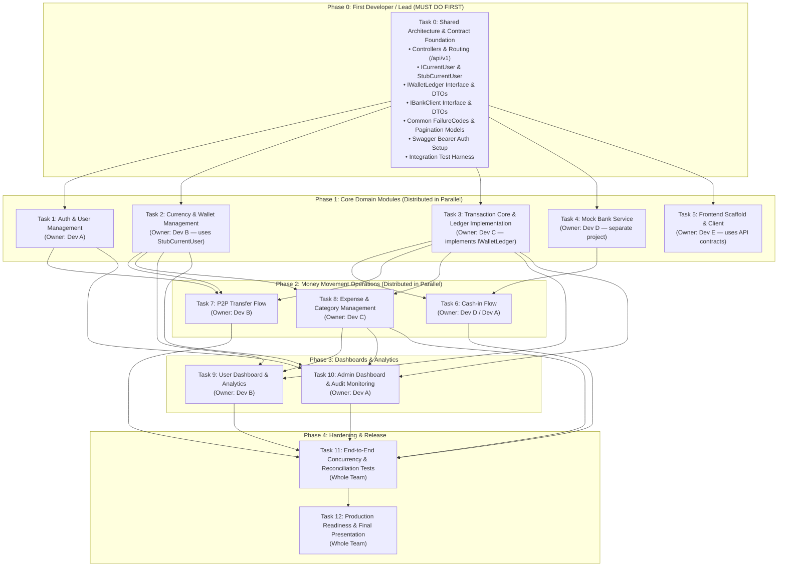

# Project Tasks & Execution Roadmap

**Project:** Digital Wallet & Expense Management System  
**Architecture:** Clean Architecture (.NET 8 Web API, EF Core, PostgreSQL)  
**Strategy:** Foundation-first (Lead Developer), followed by isolated, parallelized feature tracks for team members.

---

## 1. Executive Summary: What the First Developer Must Complete First

Before distributing tasks to team members, the **First Developer (Lead / Core Architect)** must build and merge the **Shared Foundation (Phase 0)**.

### Why Team Members Cannot Start Without Phase 0
If tasks are distributed immediately:
1. **Merge Conflict Hell:** Every developer will independently modify `Program.cs` to add controllers, Swagger authentication, routing, and DI registrations.
2. **Contract Drift:** Developer A (Auth) and Developer B (Currency/Wallet) will create conflicting versions of `ICurrentUser` or user context abstractions.
3. **Blocking Dependencies:** Developers working on Cash-in, P2P Transfers, or Expenses will be blocked waiting for `IWalletLedger` unless its interface and DTOs are predefined in C#.
4. **Inconsistent Error/Validation Responses:** Developers will build disparate validation or response formats if the pipeline isn't already wired into `ApiResponse<T>`.
5. **No Test Framework:** Team members will not write integration tests if the shared `CustomWebApplicationFactory` / test harness does not exist.

### The Foundation-First Principle
> **Rule:** The First Developer completes **Phase 0** and merges it to `main`. Once merged, **Phase 1 tasks (Tasks 1, 2, 3, 4, 5) become completely independent** and can be worked on concurrently by different team members without blocking each other.

---

## 2. Dependency Graph & Team Execution Flow



---

## 3. Detailed Task Breakdown

---

### PHASE 0: First Developer / Lead Groundwork (Must Complete First)

> **Owner:** Lead Developer / First Developer  
> **Status:** Critical Blocker for Team  
> **Prerequisites:** Existing schema & DbContext (Completed in Phase 1 setup)

#### Task 0: Shared Architecture, Contracts & Test Foundation

* **0.1 API Host & Routing Plumbing:**
  - In `src/Wallet.Api/Program.cs`:
    - Register controller support (`builder.Services.AddControllers()`).
    - Add global route prefix convention (`/api/v1`) or create `BaseApiController` inherited by all feature controllers.
    - Map controllers (`app.MapControllers()`).
  - Configure Swagger for JWT Bearer Authentication (`SecurityDefinition` + `SecurityRequirement`) so all Swagger endpoints support bearer tokens out-of-the-box.

* **0.2 Shared Contracts & Application Abstractions (`Wallet.Application/Common`):**
  - **`ICurrentUser` Interface & Development Stub:**
    - Create `ICurrentUser` interface:
      ```csharp
      public interface ICurrentUser
      {
          Guid? UserId { get; }
          string? Role { get; }
          bool IsAuthenticated { get; }
      }
      ```
    - Provide `StubCurrentUser` in `Wallet.Application` (or `Wallet.Infrastructure`) registered in DI so Dev B (Wallets) and Dev C (Transactions) can develop and test immediately before Dev A finishes Auth.
  - **`IWalletLedger` Contract & DTOs:**
    - Define the core ledger contract:
      ```csharp
      public interface IWalletLedger
      {
          Task<Transaction> CreatePendingAsync(
              Guid userId, 
              Guid currencyId, 
              TransactionType type, 
              decimal amount, 
              string? note, 
              IReadOnlyList<WalletLegDto> legs, 
              CancellationToken ct = default);

          Task<LedgerApplyResult> ApplyLegAsync(Guid walletLogId, CancellationToken ct = default);
          Task MarkSuccessAsync(Guid transactionId, CancellationToken ct = default);
          Task MarkFailedAsync(Guid transactionId, string failureCode, string failureReason, CancellationToken ct = default);
      }
      ```
    - Define `WalletLegDto(Guid WalletId, WalletLogDirection Direction, decimal Amount)`.
    - Define `LedgerApplyResult(bool Success, string? FailureCode, string? FailureReason)`.
  - **`IBankClient` Contract & DTOs:**
    - Define `IBankClient` interface:
      ```csharp
      public interface IBankClient
      {
          Task<BankDebitResult> DebitAsync(BankDebitRequest request, CancellationToken ct = default);
      }
      ```
  - **Standard Failure Codes & Models:**
    - Create `FailureCodes` static class with constants:
      - `INSUFFICIENT_BALANCE`
      - `WALLET_FROZEN`
      - `WALLET_NOT_FOUND`
      - `RECEIVER_NOT_FOUND`
      - `CURRENCY_MISMATCH`
      - `CATEGORY_INACTIVE`
      - `BANK_ERROR`
      - `SYSTEM_ERROR`
  - **Standard Pagination Models:**
    - `PagedRequest(int Page = 1, int PageSize = 10)`
    - `PagedResult<T>(IReadOnlyList<T> Items, int Page, int PageSize, int TotalCount)`

* **0.3 Validation & Error Handling Pipeline:**
  - Setup validation pipeline (e.g. FluentValidation or standard model validation filter) integrated with `ApiResponse<T>`.
  - Ensure unhandled exceptions and validation errors map cleanly to the established envelope format.

* **0.4 Testing Infrastructure Baseline (`tests/Wallet.IntegrationTests`):**
  - Setup `CustomWebApplicationFactory` with in-memory or testcontainer database support.
  - Provide base test class with authenticated client helper methods (`CreateClientWithRole(Role.User)`, `CreateClientWithRole(Role.Admin)`).

**Deliverable:** PR merged into `main`. The team pulls `main` and can now start their assigned tasks in parallel without merge conflicts.

---

### PHASE 1: Core Domain Modules (Distributed in Parallel)

> **All tasks in this phase can start simultaneously once Phase 0 is merged.**

#### Task 1: Auth & User Management
* **Assignee:** Developer A
* **Dependencies:** Task 0
* **Scope:**
  - Endpoints: `POST /api/v1/auth/register`, `POST /api/v1/auth/login`, `GET /api/v1/auth/me`.
  - Password hashing using ASP.NET Core `PasswordHasher<User>` or Argon2/BCrypt.
  - Generate JWT access tokens with `sub` (`userId`), `email`, `role`, and `accountNo` claims.
  - System `accountNo` generator service:
    - 10 digits, random, last digit calculated via Luhn check digit algorithm.
    - Unique and immutable, behind `IAccountNumberGenerator`.
  - **Registration atomic transaction:**
    - Within a single DB transaction: insert `User` AND default `Wallet` in `BDT` with balance `0`.
  - Replace `StubCurrentUser` with production `CurrentUser` extracting claims from `HttpContextAccessor`.
  - Seed initial Admin user via configuration/user-secrets.
* **Deliverable:** Working Auth module with unit and integration tests.

#### Task 2: Currency & Wallet Management
* **Assignee:** Developer B
* **Dependencies:** Task 0 (Uses `StubCurrentUser` for authentication context during development)
* **Scope:**
  - **Currency Endpoints (Admin only for mutations):**
    - `GET /api/v1/currencies` (authenticated users can read active currencies).
    - `POST /api/v1/currencies` (admin: create currency).
    - `PUT /api/v1/currencies/{id}` (admin: update name, symbol, iconUrl, decimalPlaces).
    - `PATCH /api/v1/currencies/{id}/status` (admin: activate / inactivate).
    - Delete protection: Currencies referenced by existing wallets cannot be deleted (`409 Conflict`).
  - **Wallet Endpoints:**
    - `GET /api/v1/wallets` (user: list own wallets with balances).
    - `GET /api/v1/wallets/{id}` (user: get own wallet; other user's wallet returns `404`).
    - `POST /api/v1/admin/users/{userId}/wallets` (admin: assign extra currency wallet to user; max 1 wallet per currency per user; currency must be `ACTIVE`).
    - `PATCH /api/v1/admin/wallets/{id}/status` (admin: change status `ACTIVE <-> FROZEN`; `CLOSED` allowed only if `balance == 0`).
* **Deliverable:** Currency and Wallet APIs with full input validation and integration tests.

#### Task 3: Transaction Core & Ledger Implementation
* **Assignee:** Developer C
* **Dependencies:** Task 0 (Critical Path: Phase 2 depends on this)
* **Scope:**
  - Implement `IWalletLedger` service:
    - **`CreatePendingAsync`**:
      - Validates initial leg data and creates `Transaction` row with status `PENDING`.
      - Generates a unique transaction `reference`.
      - Creates corresponding `wallet_logs` rows (one per leg; `balanceBefore` and `balanceAfter` remain `NULL`).
    - **`ApplyLegAsync`**:
      - Locks the affected `Wallet` row (`SELECT ... FOR UPDATE`).
      - Validates wallet is `ACTIVE`, matches transaction currency, and has sufficient funds if debit.
      - Computes new balance, sets `balanceBefore` and `balanceAfter` on `wallet_logs`, and updates `Wallet.balance`.
    - **`MarkSuccessAsync` / `MarkFailedAsync`**:
      - Updates `Transaction.status` to `SUCCESS` or `FAILED`.
      - On failure, persists `failureCode` (visible to user) and `failureReason` (admin detail).
  - **Transaction Query Endpoints:**
    - `GET /api/v1/transactions` (user: list own transactions + incoming P2P transfers; filter by date range, type, status; paginated). Returns `failureCode`, never `failureReason`.
    - `GET /api/v1/transactions/{id}` (user: detail view).
    - `GET /api/v1/admin/transactions` (admin: view all transactions, including `failureReason`).
* **Deliverable:** Bulletproof transactional ledger implementation with rigorous concurrency tests.

#### Task 4: Mock Bank Service
* **Assignee:** Developer D
* **Dependencies:** API Contract in Task 0 (Completely isolated)
* **Scope:**
  - Standalone service (separate web project or lightweight API in solution/docker-compose).
  - Implements contract:
    - `POST /api/bank/debit` (cash-in: validates bankCode and account, returns `200` and `bankReference`).
    - `POST /api/bank/withdraw` (cash-out: future use).
    - `POST /api/bank/refund`.
  - Idempotent by `reference`.
  - Simulates latency and supports mock failure modes (e.g. invalid account, insufficient bank funds) for testing.
* **Deliverable:** Working, standalone Mock Bank service ready for HTTP integration.

#### Task 5: Frontend Scaffold & Client (Optional / Separate Track)
* **Assignee:** Developer E / Frontend Lead
* **Dependencies:** Task 0 OpenAPI / Swagger specification
* **Scope:**
  - Scaffold frontend application using modern web standards.
  - Setup API client generated from Swagger / OpenAPI spec.
  - Create design tokens, auth session management, and wallet dashboard views using mock data.
* **Deliverable:** Running frontend connected to mock or local backend endpoints.

---

### PHASE 2: Money Movement Operations (Distributed in Parallel)

> **Tasks in this phase consume `IWalletLedger` and require Phase 1 completion.**

#### Task 6: Cash-in (Bank -> Wallet)
* **Assignee:** Developer D or Developer A
* **Dependencies:** Tasks 1, 2, 3, 4
* **Scope:**
  - Implement `IBankClient` HTTP adapter calling the Mock Bank service (`/api/bank/debit`).
  - Endpoint: `POST /api/v1/cash-in`.
  - Request: `targetWalletId`, `bankCode`, `accountNumber`, `amount`.
  - Execution Flow:
    1. Validate wallet belongs to user and is `ACTIVE`.
    2. Call `IWalletLedger.CreatePendingAsync` (credit leg on wallet).
    3. Call `IBankClient.DebitAsync(...)`.
    4. If bank returns success:
       - Call `IWalletLedger.ApplyLegAsync`.
       - Create `BankTransfer` row (`bankCode`, `bankReference`).
       - Mark transaction `SUCCESS`.
    5. If bank fails:
       - Mark transaction `FAILED` with `failureCode = BANK_ERROR` and bank detail in `failureReason`.
       - Wallet balance remains untouched.
* **Deliverable:** End-to-end Cash-in flow with integration tests for both bank success and bank failure.

#### Task 7: P2P Transfer (User -> User)
* **Assignee:** Developer B
* **Dependencies:** Tasks 1, 2, 3
* **Scope:**
  - Endpoint: `POST /api/v1/transfers`.
  - Request: `sourceWalletId`, `receiverAccountNo`, `amount`.
  - Validation Rules:
    - Receiver user identified by `accountNo` exists.
    - Receiver is not the sender.
    - Receiver has an `ACTIVE` wallet in the same currency as `sourceWalletId`.
    - Sender wallet has sufficient balance and is `ACTIVE`.
  - Execution Flow:
    1. Within a single DB transaction, acquire row-level locks on both source and destination wallets in a **consistent deterministic order** (e.g., sorted by `walletId` ascending) to prevent deadlocks.
    2. Call `IWalletLedger.CreatePendingAsync` with debit leg (sender) and credit leg (receiver).
    3. Call `IWalletLedger.ApplyLegAsync` for debit and credit legs.
    4. Insert `P2PTransfer` record linking `transactionId` and `receiverWalletId`.
    5. Mark transaction `SUCCESS`.
* **Deliverable:** Atomic P2P transfer endpoint with deadlock and edge-case unit/integration tests.

#### Task 8: Expense & Category Management
* **Assignee:** Developer C
* **Dependencies:** Tasks 1, 2, 3
* **Scope:**
  - **Expense Category Endpoints (Admin CRUD):**
    - `POST /api/v1/admin/expense-categories` (create category).
    - `GET /api/v1/expense-categories` (list active categories for user selection).
    - `PUT /api/v1/admin/expense-categories/{id}` (update).
    - `PATCH /api/v1/admin/expense-categories/{id}/status` (activate/inactivate).
    - Hard delete restriction: If category has expenses, deletion is rejected (`409 Conflict`); must set `INACTIVE`.
  - **Expense Operations (User):**
    - `POST /api/v1/expenses`:
      - Validates category is `ACTIVE` and wallet is `ACTIVE` with sufficient balance.
      - Debits wallet atomically via `IWalletLedger`.
      - Creates `Expense` row (`categoryId`, `expenseDate`).
    - `GET /api/v1/expenses` (list own expenses with filters: category, wallet, date range; paginated).
    - `GET /api/v1/expenses/{id}`.
* **Deliverable:** Category management and expense recording endpoints with unit and integration tests.

---

### PHASE 3: Dashboards & Analytics (Distributed in Parallel)

#### Task 9: User Dashboard & Summaries
* **Assignee:** Developer B
* **Dependencies:** Tasks 2, 3, 8
* **Scope:**
  - Endpoint: `GET /api/v1/dashboard/me`.
  - Returns:
    - Active wallet balances per currency.
    - Recent transactions (last 5-10, including sent/received P2P and cash-ins).
    - Recent expenses and monthly expense breakdown grouped by category.
* **Deliverable:** Aggregated dashboard endpoint with optimized read queries.

#### Task 10: Admin Dashboard & System Monitoring
* **Assignee:** Developer A
* **Dependencies:** Tasks 1, 2, 3, 8
* **Scope:**
  - Endpoint: `GET /api/v1/admin/dashboard`.
    - Total registered users, total active wallets, system-wide transaction volume.
    - Expense totals and system failure metrics.
  - Endpoint: `GET /api/v1/admin/users`:
    - Searchable list of users (by name, email, `accountNo`).
    - User detail endpoint showing assigned wallets and transaction history.
* **Deliverable:** Admin monitoring API endpoints with role authorization checks.

---

### PHASE 4: Hardening, Concurrency & Release Readiness

> **Whole Team Collaboration**

#### Task 11: End-to-End Concurrency & Reconciliation Tests
* **Dependencies:** All Phase 2 & 3 tasks
* **Scope:**
  - High-concurrency stress test: Simulate 50 concurrent transfers/expenses on the same wallet to prove no double-spending, no negative balances, and no deadlocks.
  - Invariant reconciliation test: Assert that for every wallet:
    $$\text{Wallet.balance} = \sum \text{Applied Credits} - \sum \text{Applied Debits} = \text{Latest } \text{balanceAfter}$$
  - Negative scenario verification: Bank outages, expired tokens, frozen wallets, unauthorized queries.

#### Task 12: Production Readiness & Final Polish
* **Dependencies:** Task 11
* **Scope:**
  - Clean build verification (`dotnet build` zero warnings).
  - Verify complete Swagger documentation (`[ProducesResponseType]` on all controller actions).
  - Structured logging audit: Ensure no passwords or raw credentials appear in Serilog logs.
  - Complete `README.md` with setup, environment variable documentation, and sample cURL requests.

---

## 4. Team Task Distribution Matrix

| Phase | Task ID | Task Name | Dependencies | Can Start When | Best Assignee |
|---|---|---|---|---|---|
| **Phase 0** | **Task 0** | **Architecture, Contracts & Test Harness** | None | **Immediately** | **First Developer (Lead)** |
| **Phase 1** | Task 1 | Auth & User Management | Task 0 | Task 0 merged | Developer A |
| **Phase 1** | Task 2 | Currency & Wallet Management | Task 0 | Task 0 merged | Developer B |
| **Phase 1** | Task 3 | Transaction Core & `IWalletLedger` | Task 0 | Task 0 merged | Developer C |
| **Phase 1** | Task 4 | Mock Bank Service | Task 0 (contract) | Task 0 merged | Developer D |
| **Phase 1** | Task 5 | Frontend Client & Scaffold | Task 0 (OpenAPI) | Task 0 merged | Developer E |
| **Phase 2** | Task 6 | Cash-in Flow | Tasks 1, 2, 3, 4 | Tasks 3 & 4 merged | Developer D / A |
| **Phase 2** | Task 7 | P2P Transfer Flow | Tasks 1, 2, 3 | Tasks 1, 2, 3 merged | Developer B |
| **Phase 2** | Task 8 | Expense & Category Management | Tasks 1, 2, 3 | Tasks 2 & 3 merged | Developer C |
| **Phase 3** | Task 9 | User Dashboard | Tasks 2, 3, 8 | Tasks 2, 3, 8 merged | Developer B |
| **Phase 3** | Task 10 | Admin Dashboard & Monitoring | Tasks 1, 2, 3, 8 | Tasks 1, 2, 3, 8 merged | Developer A |
| **Phase 4** | Task 11 | Concurrency & Invariant Testing | All Phase 2 & 3 | Phase 2 & 3 merged | Whole Team |
| **Phase 4** | Task 12 | Production Readiness & Docs | Task 11 | Task 11 complete | Whole Team |

---

## 5. Team Working Rules & Definition of Done

### Git Workflow Rules
1. **Never commit directly to `main`**.
2. **One feature branch per task:** `feature/task-<number>-<short-description>` (e.g. `feature/task-1-auth`).
3. **Never modify the database schema without team approval.** The database schema is already migrated and shared.
4. **Never modify shared interfaces (`ICurrentUser`, `IWalletLedger`, `IBankClient`)** in a feature branch without notifying the team.

### Definition of Done (DoD) per Task
- [ ] `dotnet build` succeeds with zero warnings (warnings treated as errors).
- [ ] Unit tests written for all domain and validation rules.
- [ ] Integration tests written using `CustomWebApplicationFactory` verifying happy path and failure status codes.
- [ ] Input validation applied to all requests (invalid inputs return standardized RFC 7807 `ApiResponse`).
- [ ] Role-based authorization verified (regular users cannot access admin endpoints; users cannot access other users' wallets/expenses).
- [ ] Controller actions include XML comments and `[ProducesResponseType]` annotations for accurate Swagger documentation.
- [ ] Structured logging includes the request `X-Correlation-Id`. No sensitive data (passwords, tokens) logged.
- [ ] PR reviewed and approved by at least one teammate before squash-merging into `main`.
